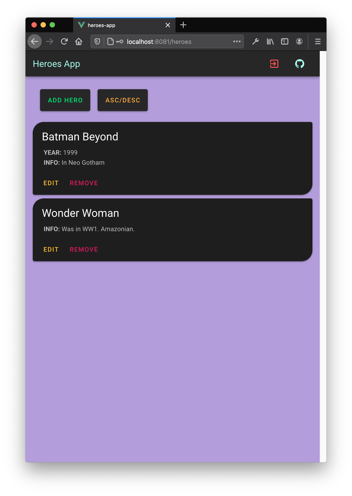

# heroes-app

The Heroes App. Allows you add information about your favourite heroes.
Basically this project turned into a more powerful todo list. However, this utilizes an API (called the Heroes API) that allows for CRUD operations to be applied to this data.

You can add, remove, edit and control the order of your heroes:

<p align="middle">



</p>

Feature I would like to add: User authentication.

## Project setup
```
npm install
```

### Compiles and hot-reloads for development
```
npm run serve
```
